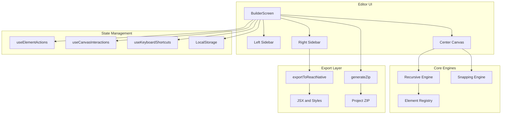

<div align="center">


# Brainstorm Builder

### High-performance, low-code visual editor for React Native — Made Simple

A "WYSIWYG" environment that allows developers and designers to build complex mobile UIs and export production-ready Expo code.

🎥 **[Watch the App Demo Video here](https://link-to-your-demo.com)**

Built with **React 19** | Powered by **Vite** | Exporting to **Expo**

---

</div>

## About

Brainstorm Builder is a powerful visual development tool designed to bridge the gap between design and production code for React Native. It features a high-precision recursive rendering engine that allows for infinite nesting of UI components, from basic buttons and text to complex cards and scrollable lists.

The editor provides a seamless developer experience with real-time JSON schema sync, smart snapping for pixel-perfect layouts, and a modular export system that generates a complete Expo project structure, including navigation and optimized styles.

---

## Screenshots

### 🖥️ Workspace & Canvas


**Dark Theme** — The primary workspace uses a deep, glassmorphism-inspired dark theme designed for focus and reduced eye strain. The multi-sidebar layout keeps assets, layers, and inspectors easily accessible.

---


**Light Theme** — For those who prefer a brighter environment, the editor features a clean, high-contrast light theme. All UI elements, from the canvas to the sidebar tabs, adapt perfectly to the light color palette.

---


**Grid & Snapping** — High-precision alignment guides. The engine provides real-time snapping to grid lines and relative positioning to other elements, ensuring pixel-perfect layouts without manual coordinate entry.

---

### 🔍 Inspector & Code Preview


**Properties Inspector** — Deeply customize every element. Change typography, colors, layout properties (Flexbox), and interaction types (Navigation, Toggle Drawer) through a clean, intuitive interface.

---


**Live Code Preview** — See the React Native code as you build. The right sidebar can switch between the Inspector and a live-updating code view, showing the exact JSX and Stylesheet code that will be exported.

---

### 🚀 Preview & Export


**Preview Mode** — Test your app's feel instantly. Toggle Preview Mode to hide the editor chrome and interact with your UI as it would appear on a real device, including functioning navigation and button interactions.

---


**Export App** — From design to code in one click. The export system bundles your entire project — including screens, navigation config, and component registry — into a clean ZIP file ready for Expo.

---

## Features

### Core Editor
- **Recursive Rendering Engine** — Supports infinite nesting of UI components (Containers, Rows, Columns, Cards) with accurate Flexbox behavior.
- **Smart Snapping Engine** — High-precision alignment guides relative to canvas boundaries and other elements.
- **Bi-directional Editing** — Visual canvas and raw project schema are always in sync.
- **Device Simulation** — Switch between iOS and Android frames to see how your layout adapts to different screen sizes.
- **Dynamic Registry** — Easily extend the component library via a centralized JSON-driven registry.

### UI and Components
- **Rich Component Library** — Includes View, Text, Image, ScrollView, FlatList, TextInput, Button, Card, Icon, and more.
- **Layout Primitives** — Dedicated Row and Column components for quick Flexbox layouts.
- **Navigation Elements** — Specialized components like Stack Header and Drawer for building standard mobile navigation patterns.
- **Interaction System** — Set up navigation triggers and drawer toggles directly within the editor.
- **Glassmorphism UI** — A modern, sleek editor interface with dark and light theme support.

### Export & Code Generation
- **Modular Expo Export** — Generates a structured React Native project with separate screens and optimized styles.
- **Navigation Config** — Automatically generates `App.js` with Expo Router or React Navigation boilerplate based on your project structure.
- **Asset Bundling** — Exports all project data into a ZIP file using JSZip for easy sharing and deployment.
- **Clean JSX Output** — Generates human-readable, idiomatic React Native code.

### Workflow & Productivity
- **Keyboard Shortcuts** — Delete elements, toggle preview, and save progress with standard hotkeys.
- **Persistence** — Automatic local storage saving ensures you never lose your progress.
- **Multi-page Support** — Manage complex apps with multiple screens and shared navigation.
- **Haptic Feedback Simulation** — (Planned) Visual indicators for mobile-native interactions.

---

## Tech Stack

| Layer | Technology |
|-------|-----------|
| **Framework** | React 19 (Vite) |
| **Styling** | Modern CSS (Variables, Glassmorphism) |
| **Icons** | Lucide React |
| **Interactions** | Native Pointer Events API |
| **Export Engine** | JSZip & FileSaver.js |
| **Architecture** | Component Registry Pattern |

---

## Project Architecture

### Data Flow Diagram



### Folder Structure

```text
web/src/
├── app/
│   └── BuilderScreen.jsx        # Main editor entry point
├── canvas/
│   ├── Canvas.jsx               # Core rendering canvas
│   └── PhoneFrame.jsx           # Device simulation wrapper
├── components/
│   ├── ButtonElement.jsx        # Specialized UI elements
│   ├── CardElement.jsx
│   ├── ContainerElement.jsx
│   └── ...
├── editor/
│   └── EditPanel.jsx            # Property inspector (Inspector)
├── export/
│   ├── exportToReactNative.js   # Code generation logic
│   └── generateZip.js           # Project bundling
├── hooks/
│   ├── useCanvasInteractions.js # Drag, drop, resize, snap
│   ├── useElementActions.js     # CRUD for elements/pages
│   └── useKeyboardShortcuts.js  # Editor hotkeys
├── layers/
│   └── LayersPanel.jsx          # Hierarchical view
├── registry/
│   └── elementRegistry.js       # Component definitions & props
└── templates/
    └── templates.js             # Starter screen templates
```

---

## Setup Instructions

### Prerequisites

- **Node.js 18+**
- **npm** or **yarn**

### 1. Clone the Repository

```bash
git clone https://github.com/your-username/brainstorm-builder.git
cd brainstorm-builder
```

### 2. Install Dependencies

```bash
cd web
npm install
```

### 3. Run Development Server

```bash
npm run dev
```

The editor will be available at `http://localhost:5173`.

### 4. Build for Production

```bash
npm run build
```

The optimized assets will be generated in the `dist` folder.

---

## Key Design Decisions

| Decision | Rationale |
|----------|-----------|
| **Recursive Rendering** | Allows for complex, nested UI structures that mirror real React Native layouts. |
| **JSON-First State** | Every element is a JSON object, making it trivial to sync with code and persist. |
| **Pointer Events API** | Provides consistent drag-and-drop behavior across desktop and touch devices. |
| **Registry Pattern** | Decouples element definitions from rendering logic, making it easy to add new components. |
| **Local Persistence** | Ensures user progress is saved instantly without requiring a backend. |

---

## License

MIT
